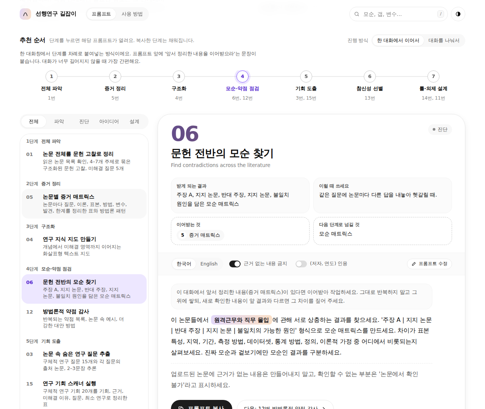
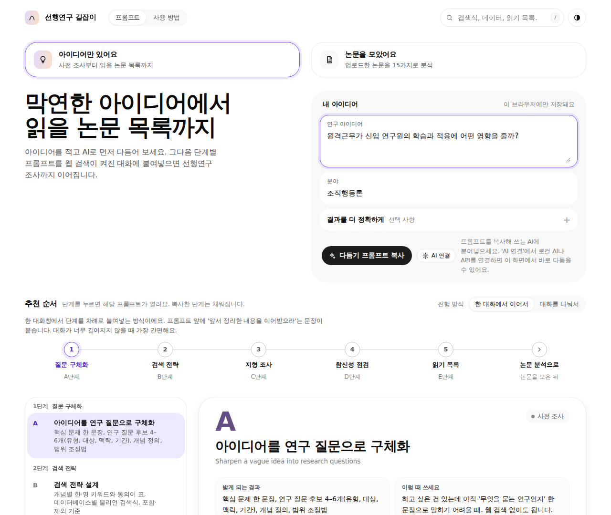
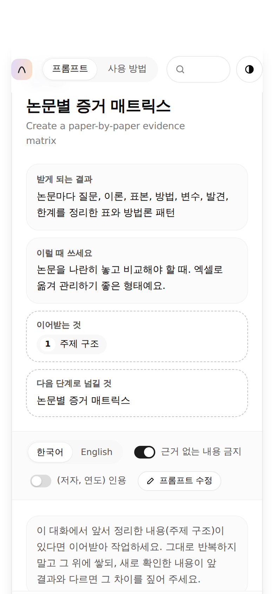

# 선행연구 길잡이

연구 아이디어에서 연구 의제까지, 선행연구 조사와 논문 분석을 **단계별 프롬프트**로 안내하는 웹 도구입니다. 대학원생과 연구원을 위해 만들었어요. 파일 하나(`index.html`)로 동작하고, 서버나 빌드가 필요 없습니다.

> **English summary:** A single-file web app (Korean UI) that guides researchers from a vague idea to a research agenda with step-by-step prompts for any AI chat. Pick a starting point (idea only / papers collected), fill in your topic once, copy each prompt, and chain the results from step to step. No server, no build, no tracking. MIT licensed.



## 두 가지 출발점

| 출발점 | 이럴 때 | 흐름 |
|---|---|---|
| **아이디어만 있어요** | 주제는 떠올랐지만 읽은 논문이 거의 없을 때 | 질문 구체화 → 검색 전략 → 지형 조사 → 참신성 점검 → 읽기 목록 → 논문 분석으로 |
| **논문을 모았어요** | 분석할 PDF가 이미 있을 때 | 전체 파악 → 증거 정리 → 구조화 → 모순·약점 점검 → 기회 도출 → 참신성 선별 → 틀·의제 설계 |



## 주요 기능

- **한 번 입력하면 모든 프롬프트에 채워져요.** 주제와 분야를 적으면 되고, 연구 목적, 맥락, 선호하는 방법론은 선택으로 더할 수 있어요.
- **추천 순서와 단계 연결.** 각 단계가 앞 단계의 어떤 결과를 이어받고, 무엇을 다음 단계로 넘기는지 보여줍니다.
- **두 가지 진행 방식.** 한 대화에서 이어서 쓰거나, 대화를 나누고 이전 결과를 프롬프트 앞에 자동으로 담아 복사할 수 있어요.
- **한국어와 영어 프롬프트.** 영어로 쓰면서 한국어로 답변받는 옵션이 있어요.
- **프롬프트 직접 수정**과 '원래대로' 되돌리기.
- **AI로 다듬기.** 막연한 아이디어를 연구 질문 후보, 핵심어, 검색식으로 바꿔 줍니다. 로컬 AI나 API를 연결하거나, 프롬프트를 복사해 다른 AI에서 쓸 수 있어요. ([설정 방법](./docs/self-hosting.md))
- **진행 기록 내려받기.** 연구 정보와 단계별 답변을 마크다운 파일로 저장합니다.
- 사용 방법 페이지, 다크 모드, 모바일 대응, 키보드 조작을 지원해요.

<p align="center"></p>

## 바로 쓰기

**GitHub Pages로 공개하기**
1. 저장소의 Settings → Pages에서 Source를 `Deploy from a branch`, Branch를 `main`, 폴더를 `/ (root)`로 지정합니다.
2. 잠시 뒤 `https://<계정명>.github.io/<저장소명>/`에서 열립니다.

**내 컴퓨터에서 쓰기**
- `index.html`을 브라우저로 열면 됩니다. 또는 폴더에서 `python3 -m http.server 8000`을 실행하고 `http://localhost:8000`을 여세요.

## 개인정보와 데이터

- 서버로 보내는 데이터가 없고, 분석 도구나 추적 코드도 없어요.
- 입력한 연구 정보, 저장한 답변, 수정한 프롬프트, AI 연결 설정은 **각자의 브라우저 저장 공간**에만 남습니다. 사용 방법 페이지의 '저장된 내용 관리'에서 내려받거나 지울 수 있어요.
- 'AI로 다듬기'에 AI를 연결한 경우에만 아이디어와 선택 항목이 **내가 지정한 주소**로 전송됩니다.
- 글꼴은 실행할 때 Google Fonts에서 불러옵니다. 외부 요청을 피하려면 `index.html`의 `fonts.googleapis.com` 링크를 지우세요. 글꼴만 시스템 글꼴로 바뀌고 기능은 그대로예요.

## 연구에 쓸 때 주의할 점

- AI가 만든 결과는 **초안**입니다. 인용과 서지 정보는 반드시 원문과 대조하세요. 존재하지 않는 논문이나 틀린 연도가 섞일 수 있어요.
- 투고처, 학위 과정, 연구 과제 기관의 생성형 AI 사용 지침을 확인하세요.
- 구독 논문, 심사 중인 원고, 미공개 데이터, 개인정보가 담긴 자료를 외부 AI 서비스에 올리기 전에 약관과 소속 기관의 규정을 확인하세요.

## 저장소 구성

```
index.html            앱 전체 (HTML, CSS, JS 한 파일)
docs/self-hosting.md  AI 연결과 직접 호스팅 안내
docs/*.png            README 스크린샷
NOTICE.md             출처와 제3자 고지
LICENSE               MIT 라이선스
```

`index.html` 안의 `window.claude`를 쓰는 코드는 Claude 안에서 열었을 때만 동작하는 부분이고, 다른 환경에서는 자동으로 무시됩니다.

## 기여

오탈자, 번역 개선, 새 단계 제안, 버그 신고를 환영해요. Issues나 Pull Request로 남겨 주세요. 프롬프트를 고칠 때는 `index.html`의 `PP`(논문 분석)와 `IP`(사전 조사) 배열을 수정하면 됩니다.

## 출처와 라이선스

이 프로젝트는 [MIT 라이선스](./LICENSE)로 공개합니다.

- **디자인 토큰:** [Arc Library](https://github.com/kuratlielia/arc-library)(MIT, © Elia Kuratli)
- **글꼴:** Geist, IBM Plex Sans KR (SIL OFL 1.1, Google Fonts)

자세한 내용은 [NOTICE.md](./NOTICE.md)를 확인하세요.

© 2026 [YOUR NAME]
